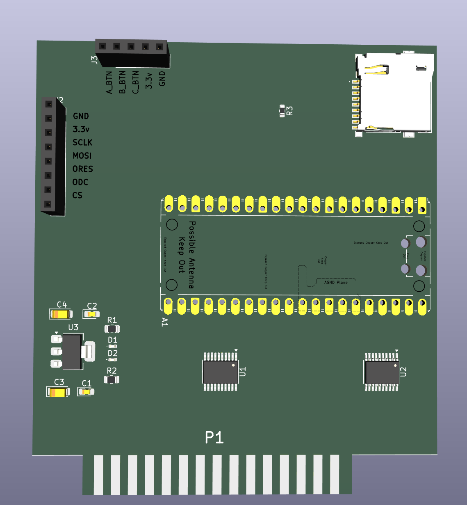

# NorthStar Advantage Hard Disk

This repository is made with the aim of completing a HardDisk Card for the NorthStar Advantage system. 

The idea is use a microcontroller (pi pico) to emulate a disk drive, allowing the NorthStar Advantage to read and write to a disk image stored on an SD card.

This is an ambitious project, as the NorthStar Advantage system is quite old and has a unique architecture, but it is a fun challenge. I am an enthusiast of retro computing and I want to see if I can make this work. So any help will be welcome.

Outside sure there a lot of other enthusiasts that would like to see this project completed, so welcome to the project!

## Current status

- The project is in the early stages of development.

## Pi pico plan (code)

Continuously monitor the /SELECT line (via PIO) when /SELECT is asserted (low); and monitor the primary I/O control: 
/BRD (I/O Read), /BWR (I/O Write), /IDREQ (Board ID Read).

### Address decoding 
Capture the lower I/O address bits (IOA0–IOA3) (IOA3 is not used in HD controller) from the bus when an active cycle is detected. Get the target register.

### I/O reads 
Upon detecting an I/O read cycle (/SELECT low and /BRD low): 
- Push the captured port address (IOA0–IOA3) to the PIO's RX FIFO to notify the CPU and push the captured port address to the CPU's RX FIFO.
- Change the direction of the IOD0–IOD7 data lines to output while waiting for the CPU to write the requested data byte into the PIO's TX FIFO.
- Once the TX FIFO contains data, unblock it and drive the byte onto the IOD0–IOD7 lines.
- After /BRD goes high, change the direction of IOD0–IOD7 back to input (tristate).

### I/O writes 
Upon detecting an I/O write cycle (/SELECT low and /BWR low):
- Ensure that the IOD0–IOD7 lines are configured as inputs.
- Capture the port address (IOA0–IOA3) and push it to the RX FIFO.
- Obtain the data byte present on the IOD0–IOD7 lines.
- Push the data byte to the RX FIFO and notify the CPU.
- Wait for the /BWR signal to be deasserted (go high).

### Board ID 
Upon detecting an ID Read cycle (/SELECT low AND /IDREQ low)
- Push the relevant port address.

Once the CPU is informed take the actions read registers, read/write to sdcard.

## References

- [NorthStar Advantage ROMs dissasembly](https://github.com/dualityk/advantageroms)
- [Evan Allen's NorthStar Advantage Cards](https://github.com/abzman/Northstar-Advantage-Cards)

## Special thanks

- [Evan Allen](https://github.com/abzman) for the inspiration and initial work on the NorthStar Advantage cards and help me with the project.

